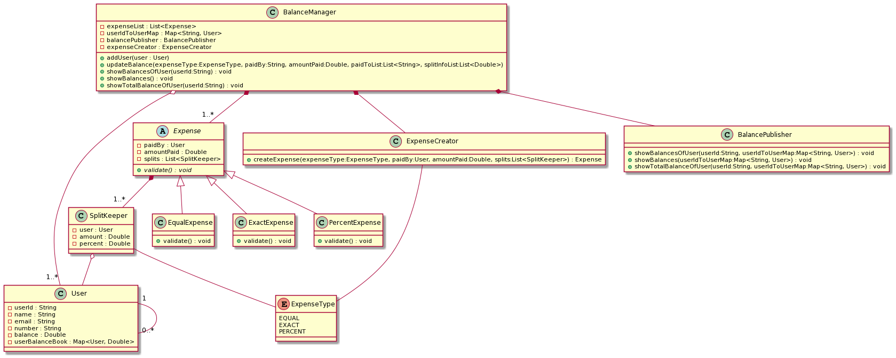

Some problems to practice lld and implementing it for interviewing process. My solutions to the problems here is on my first trial. There is possibility of improvement in design and patterns I've used.

[SnakesAndLadder](https://workat.tech/machine-coding/practice/snake-and-ladder-problem-zgtac9lxwntg)
[My Solution](https://github.com/Aditya121995/Practice/tree/main/SystemDesign/src/main/java/systemDesign/snakeAndLadder)

--------------------------------------------------------------------------------------------------------------------------------------------------------

[OpinionPoll](https://www.notion.so/Opinion-poll-calculation-ad0fdac585704bd5a1c537f1ff1be8ab)
[My Solution](https://github.com/Aditya121995/Practice/tree/main/SystemDesign/src/main/java/systemDesign/opinonPoll)

--------------------------------------------------------------------------------------------------------------------------------------------------------

[SplitWise](https://workat.tech/machine-coding/practice/splitwise-problem-0kp2yneec2q2)
[My Solution](https://github.com/Aditya121995/Practice/tree/main/SystemDesign/src/main/java/systemDesign/splitWise)

--------------------------------------------------------------------------------------------------------------------------------------------------------

